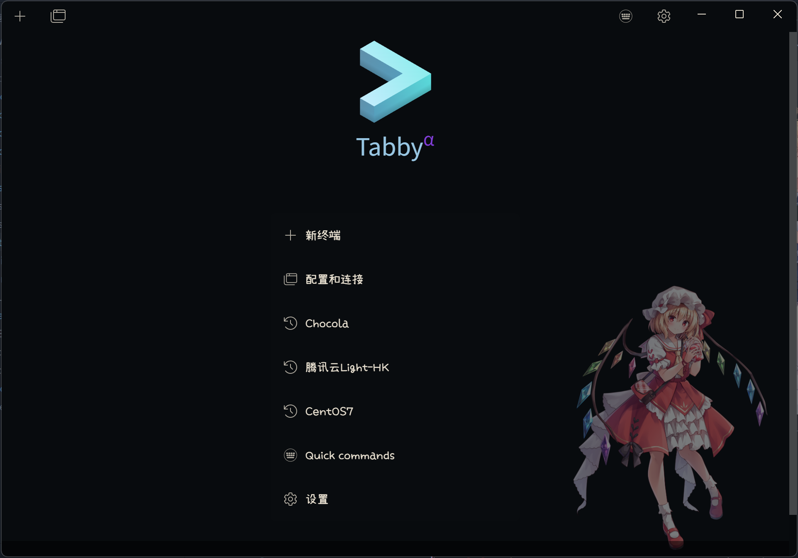

# Tabby Background Plugin

Change Tabby background image and more...

## Features

- Change background to your favorite picture.
- Change UI Font to your favorite font, not affect terminal font.
- All changes applied in pure css, no dynamic javascript.

## Usage

Install: To install, use Tabby builtin plugin manager.

Background: Enter the image file path into textbox or use the file picker.

Portable Mode: For who use portable mode and want to use relative image path, image can be placed in portable **data** directory, the image path must begin with **../../../data/**.

UI Font: Enter the font family name into the textbox, can use the font name in [appearance] setting tab.

Currently tested on Windows and MacOS.

## Screenshot

### Settings

### Fullscreen

### Float

## Changelog

- 1.2.4: Add terminal toolbar transparent.
- 1.2.3: Float mode.
- 1.2.2: Add Group list transparent.
- 1.2.0: Add tabs parameter override.
- 1.1.4: Do not depend on in app global css.
- 1.1.2: Add image file picker.
- 1.1.0: Add change UI font.
- 1.0.0: Initial version.
