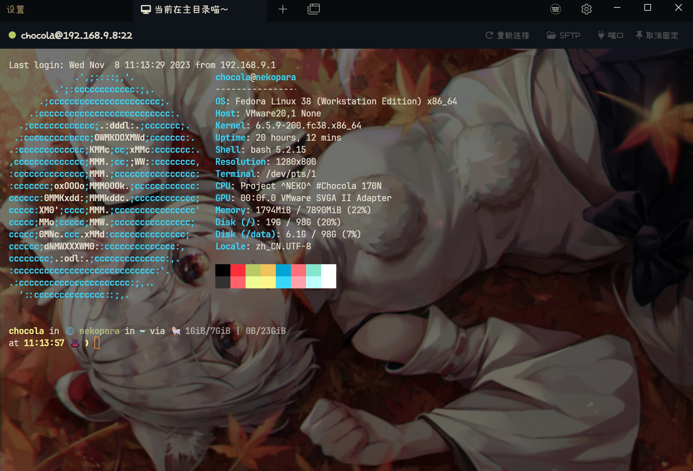

# Tabby Background Plugin

Change Tabby background image and more...

## Features

- Change background to your favorite picture.
- Change UI Font to your favorite font, not affect terminal font.

## Usage

Background: Enter the image file path into textbox or use the file picker.

Portable Mode: For who use portable mode and want to use relative image path, image can be placed in portable **data** directory, the image path must begin with **../../../data/**.

UI Font: Enter the font family name into the textbox, can use the font name in [appearance] setting tab.

Currently tested on Windows and MacOS.

## Screenshot

