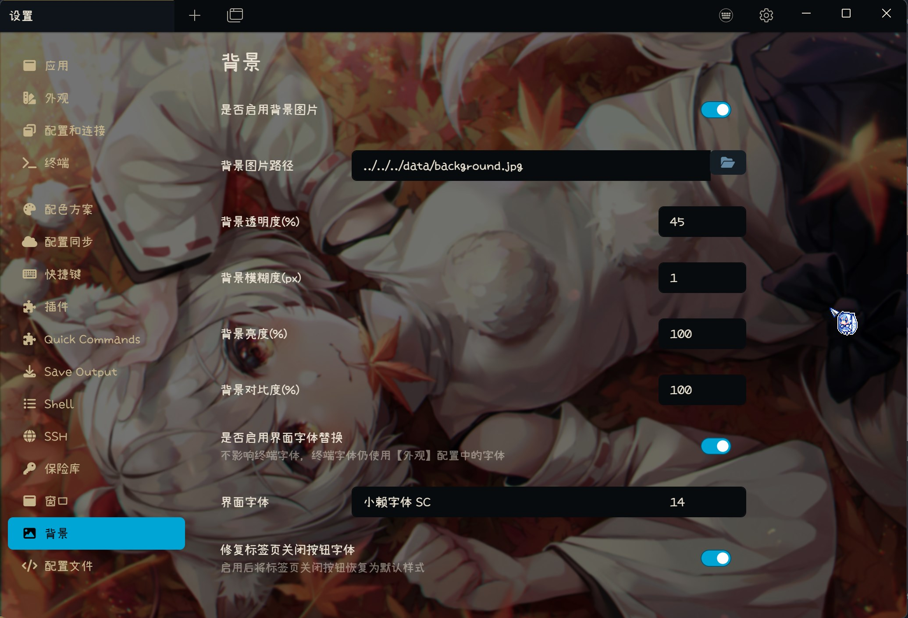

# tabby-background

Change Tabby background image and UI Font.

## Features

- Change Tabby background to your favorite picture.
- Change UI Font to your favorite font, not affect terminal font.

## Usage

Background: Enter the picture path into textbox or use the file picker, support absolute path and relative path(for portable mode).

UI Font: Enter the font family name into the textbox, can use the font name in [appearance] setting tab.

## Screenshot

