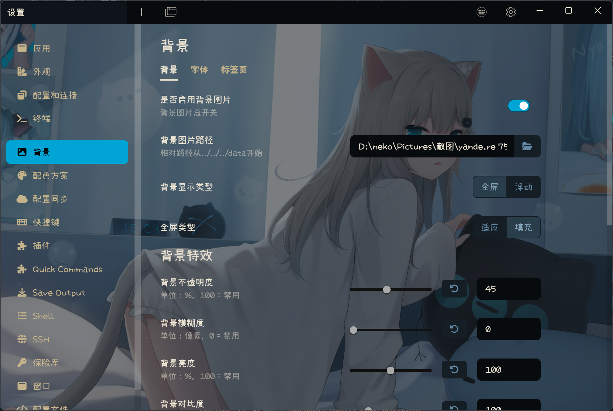

# Tabby Background Plugin

Change Tabby background image and more...

## Features

- [x] Change background to your favorite picture.
- [x] Change UI Font to your favorite font, not affect terminal font.
- [x] All changes applied in pure css, no dynamic javascript.
- [x] All changes can be disable separately.
- [x] Compatible with builtin black and white skin.
- [x] Support English and Chinese.
- [x] Tested on Windows and MacOS with Tabby version 1.0.205.

## Usage

### Install

To install, use Tabby builtin plugin manager.

### Change Background Image

Enter the image file path into textbox or use the file picker.

For who use portable mode and want to use relative image path, image file can be placed in portable **data** directory, the image path must begin with **../../../data/**.

### Change UI Font

Enter the font family name into the textbox, can use the font name in **appearance** setting tab.

## Screenshot

### Settings Tab

### Fullscreen Mode

### Float Mode

## Changelog

- 1.3.3: Change bootstrap method, provide more fluent experience.
- 1.3.2: Add tab dimming settings, remove tabs parameter override.
- 1.3.1: Cleanup and minify.
- 1.3.0: UI rearrange.
- 1.2.6: Add drop shadow filter for float mode.
- 1.2.5: Add more background filters.
- 1.2.4: Add terminal toolbar transparent.
- 1.2.3: Add float mode.
- 1.2.2: Add group list transparent.
- 1.2.0: Add tabs parameter override.
- 1.1.4: Do not depend on in app global css.
- 1.1.2: Add image file picker.
- 1.1.0: Add change UI font.
- 1.0.0: Initial version.
